# 数据科学学习笔记

‘使用Ctrl+F查找关键字’

## 一、Python基础及课堂笔记

### 1、必用基础语法

 ```python
"3" + 2 #不同类型不能加

#Python中的变量名是引用
a = 2
id(a)

#可以中文变量名，但别用！命名要规范
quzheng = int
int = 3
a= int(5)

print=0
x=0
print(x)

#Key Words Module
import keyword
print(keyword.kwlist)
print(len(keyword.kwlist))
dir(keyword) #Module Function


#变量删除
i = 20
del i
print(i)


#一句分多行  连句符
print("nin\
hao")

#循环
sum = 0  # syntax ATTENTION
for i in range(1,10):
    sum = sum + i
    print(i)
print(sum)

#空语句
x = 1
y = 2
if x>y:
    pass
else:
    print(x+y)
    
#赋值语句
a = 1
b = 2
print(a,b)
a, b = b, a #创建了一个元组分别给a,b赋值
print(a,b)


#位或位与
#round函数有bug 四舍六入
#cmath可以用sqrt开根号
import math
dir(math)

#大小比较
#if else elif
if a<=b:
    if a<b:
        print(a)
    else:
        print(a)
else:
    print(b)
        
x = 0
Result = "Y" if x>0 else "N"
Result

  if(a<=b):
    pass #空语句
else:
    print(b)  

#日历模块
import calendar
calendar.isleap(2019) 


#Python has no "switch"
#求解一元二次方程
#判断是否等根时，尽量避免delta == 0的写法
#多个分支应该尽量把可能性高的分支放在前面

0.1 + 0.2 == 0.3
a = 1
b = -2
c = 1
delta = b * b - 4*a*c
epsilon = 1e-12 #要设置误差区间
if delta > epsilon:
    x1 = {-b + delta ** 0.5}/{2*a}
    
#变量值不精确问题
print(0.1 + 0.2 - 0.3)

#range函数
range(1,10)
#10取不到

myList = list(range(1,10))
myList

#步长可正可负
s = 0
for i in range(1 , 11):
    s += i
    if i > 5:
        break
else:
    print('ok')
print(s)

#format函数
for i in range(1, 10):
    for j in range(1, i + 1):
        print("%d*%d=%d" % (j, i, j* i), end = '/t')
    print()
    
#While 语句
import random
com = random.randint(1,10)
while True:
    my = int(input("请输入一个1-10之间的数："))
    if my > com:
        print("太大了")
    elif my < com:
        print("太小了")
    else:
        print("猜对了！")
        break

# List
myList1 = [21,22,23,24,25,26,27,28,29]
myList1

#可以用负数反过来数List的元素
myList2 = myList1
myList2

a= [1,2,3]
print(id(a))
b = [1,2,3]
print(id(b))
c = a
print(id(c))

#切片操作
myList1

#取出一个子列表 8取不到
myList1[1:8]
myList1[:5]
myList1[1:8:2]
myList[2:]

#不标终点可以取到最后一个
myList[:-1]
LIST1 = [1,2,3,4,5]
LIST1[3:3] = [6,7]
LIST1

#换成空list可以删除
LIST1 = [1,2,3,4,5]
LIST1[::2] = ['x', 'y', 'z']
LIST1

#反向遍历
myList1

myList[::-1]

reversed(myList1)
list(reversed(myList1))
myList1.reverse()
myList1

myList1 = [21,22,23,24,25,26,27,28,29]
myList2 = myList1
myList1 + myList1

# append函数 复制了一个元素指向 重点 查资料
myList1.append(myList2)
myList1
[2 for i in range(20)]
[i for i in range(1,21)]
[i for i in range(1,21,2)]
[type(item) for item in[True, "1", 1, 1.0]]
print([ord(i) for i in['朝', '乐', '门']])

a = [1,2,3]
b = [4,5,6]
list(zip(a,b))
[i + j for i,j in zip(a,b)]

#List.pop & insert
a = [1,2,3]
a.insert(100,'x')
a

a.insert(-100,'y')
a

# pop超出索引会报错
list2 = [10,10,11,12,13,14,15]
for i in list2:
    if 10 not in list2:
    list2.remove(10)
print(list2)

dir(list)

#extend append 区别
str1 = ["a", "about","c","china","b","beijing"]
[str2.upper() for str2 in str1 if]
str2()

list(enumerate(myList))

sum = 0
[dic((value,i) for i,value in enumerate(myList))]

#元组不可变
myTuple = 1,3,5,7,2
myTuple[2] = 100

print(sorted(myTuple))

a = 'seu'
print("abc'de")

str1 = """
你好！
我好！
大家好！"""
str1
print(str1)

s= [1,2,3]
x = s # 同一个
x[0] = 2
print(s)
y = s.copy() #浅拷贝
 ```

### 2、字典相关

```python
f1 = (7,9,10,5,8,4,2,1,6,3,7,9,10,5,8,4,2)

id = '320981197912220957'
s = 0
for ch in id[:-1]:
    s += f1[i] * int(id[i])
s %= 11
print(t = '合法' if 
if (f2[s]) == id[17]:
    print('合法')
else:
    print("不合法")
    
      
person = {'name' : 'zhang','age': 29, 'gender':'sex'}

for p in person.keys():
    print(p)
    
for p in person.values():
    print(p)

for p in person.items():
    print(p)
      
t = copy.deepcopy()
      
#字典更新
d = {'name': 'alice', 'age' : 19, }


y = d.copy()
y.update(x)

while True:
    a = float(input('请输入数1'))
    b = float(input('请输入书2'))
    c = input('请输入运算符')
    di = {'+':a+b,'-':a-b,'*':a*b,'/':a/b}
    if c not in di:
        break
    print("%f%s%f = %f" % (a,c,b,di[c]))

#统计单词字数
sentence = 'how are you ? Fine, thank you. And you? I am fine too.'
stat = {}
for word in sentence.split():
    if word.isalpha():        
        num = stat.get(word, 0)
        stat[word] = num + 1
print(stat)
  
print(dir(__builtins__))     

#相关函数
abs(-1)
min
max
pow()
round
int
bool
float
str
list
set
tuple
type
isinstance(i, int)
list
callable

import math
math.sin(1.5)
from math import cos
cos(1.5)
from math import sin
sin(1.5)          
```

### 3、函数相关及高阶函数

```python
def func():
    j = 0
    print('hello world')
    
    def func2(i):
        print('pass'+str(i)+str(j))
        
    return func2 #闭包

func()(2)
def get_name(msg):
    #"""dadasdfsaf"""
    name = input(msg) or 'Anonymous User'
    return name
print(get_name('input'))
help(get_name)

def isprime(n):
    if n == 2:
        return True
    elif n % 2 == 0:
        return False
    k = int(n **0.5)
    for i in range(2, k+1):
        if n% i ==0:
            return False
    return True

s = [i for i in range(2, 101) if isprime(i)]

print(s)

#没有返回值默认none
def my_func(x1,*x2,x3,x5 =5,x4=4):
    print(x1)
    print(x2)
    print(x3)
    print(x4)
    print(x5)
my_func(1,2,4,x3 = 3,x5 = 5)

#默认参数要放最后
def f(x= 1, 1)

x = 0
def myFunc(i):
    x = i
    print(x)
    
myFunc(1)
print(x)

#全局变量
x = 0
def myFunc(i):
    global x
    x = i
    print(x)
myFunc(1)

#Fibbo
count = 0
def fib(n):
    global count
    count += 1
    if n ==1 or n ==2:
        return 1 
    return fib(n - 1) + fib(n - 2)

print(fib(40))
print(count)

x = 2 
y = lambda x:x+3
y(2)
y(6)

MyList = [1,2,3,4,5,6,7,8,9,10]
filter(lambda x:x%3 == 0, MyList)
list(filter(lambda x:x%3 == 0, MyList))

list(map(lambda x:x*2, MyList))

from functools import reduce
print(reduce(lambda x,y: x+y, MyList))
```

### 4、迭代器生成器

```python
#迭代器与生成器
a = [1,2,3]
b = reversed(a)
print(a)
print(next(b))
print(next(b))
print(next(b))
print(next(b))
for x in b:
    print(x, end = ',')

for x in b:
    print(x, end =',')
    
for x in a:
    print(x, end = ',')

for x in a:
    print(x, end =',')
    
#可迭代对象与迭代器
#List 之类都是可迭代对象，迭代器是特殊的
 
a = range(100)
next(a)

from collections import Iterable
myList = [1, 2, 3]
a = reversed(myList)

def myGen():
    x = range(1,11)
    for i in x:
        yield i+2
        

a = myGen()
next(a)
next(a)
next(a)

import datetime
a = range(0, 50000000)
s = 0
start = datetime.datetime.now()
b = []
for i in a:
    b.append(i)
end = datetime.datetime.now()
print(end - start)

s = 0
start = datetime.datetime.now()
c = (i for i in a)
end =  datetime.datetime.now()
print(end - start)

#装饰器
def count_time(func):
    def wrapper(*args, **kw):
        start = datetime.datetime.now()
        t = func(*args, **kw)
        end = datetime.datetime.now()
        print(end - start)
        return t
    return wrapper

@count_time
def f():
    a = [i * i for i in range(50000000)]
    return a

f()

def logging_check(func):
    def wrapper(*args, **kw):
        password = input("Password:")
        if password == '1213791749':
            return func(*args, **kw)
        else:
            print("illegal")
    return wrapper

@logging_check
def f():
    a = 2
    print(a)
    return a

f()
```


### 5、模块使用

```python
# 模块
import sys
print(sys.builtin_module_names)

"""
help函数"""

testDocString.__doc__

a= [1, 2, 3]
b = reversed(a)
print(next(b))
print(b.__next__())

import os
print(os.getcwd())

```

### 6、面向对象——类相关

```python
class Person:
    nationality = 'China'
    _deposit = 10e10
    __gender = "M"
    
    def __init__(self, name, age): #类似this指针
        self.name = name
        age = age
        
    def say_hi(self):
        print(self.name)
        
    @classmethod
    def class_func(cls):
        cls.nationality= 'CHINA'
        print('I live in {0}'.format(cls.nationality))
    
pl = Person('Tom', 30)
pl.say_hi()
pl.class_func()

while True:
    try:
        a = int(input("Please input a:"))
        b = int(input("Please input b:"))
        c = a/b
        print(c)
    except ValueError:
        print("数据格式错误")
    except ZeroDivisionError:
        print("除数不为0")
    finally:
        pass
    
    
class Student:
    __name = "Zhang"
    age = 18
    
    
    def get_name(self):
        return self.__name
    
    def set_name(self, n):
        self.__name = n

s = Student()
print(s.get_name())
s.set_name('Wang')
print(s.get_name())

class Student:
    __name = "Zhang"
    age = 18
    
    @property
    def name(self):
        return self.__name
    @name.setter
    def set_name(self, n):
        self.__name = n

s = Student()
print(s.name)
s.name = 'Wang'
print(s.name)

a = '我爱你'
print(a.encode('gb2312'))
print(a.encode('utf8'))

f = open('myfile.txt')
g = open('level.txt','w')
f.readline()
while True:
    line =  f.readline()
    if line == '':
        break
    ls = line.split()
    if int(ls[1]) > = 85 and int(ls[2] >= 85 and int(ls[3]) >= 85:
        g.write
    print(ls)
```

## 二、面向对象编程拓展

面向对象编程是现代编程一种重要思想，于是我在课程介绍的类之外作一些拓展

### 1、访问限制

```python
#根据类创建实例
class Student(object):
    pass

#用一个变量指向一个实例
bart = Student()
bart
Student

#给实例绑定属性
bart.name = 'Ray'
bart.name

#private私有变量建立，内部可以访问，外部不可访问
class Student(object):
#无法从外部访问name和score
    def __init__(self, name, score):
        self.__name = name
        self.__score = score

    def print_score(self):
        print('%s: %s' % (self.__name, self.__score))
bart.__name #会报错
#从外部获取需要在类内添加get_name
	def get_name(self):
        return self.__name

    def get_score(self):
        return self.__score
    
#从外部添加需要增加set
	def set_score(self, score):
        self.__score = score
        
#可以对参数做检查，避免传入无效的参数 
	 def set_score(self, score):
        if 0 <= score <= 100:
            self.__score = score
        else:
            raise ValueError('bad score'）


```

### 2、继承与多态

```python
#定义一个class的时候，可以从某个现有的class继承，新的class称为子类（Subclass），而被继承的class称为基类、父类或超类（Base class、Super class）
class Animal(object):
    def run(self):
        print('Animal is running...')

#从Animal类继承，继承了父类的所有功能
class Dog(Animal):
    pass

class Cat(Animal):
    pass

dog = Dog()
dog.run()
cat = Cat()
cat.run()

#对子类添加功能
class Dog(Animal):

    def run(self):
        print('Dog is running...')

    def eat(self):
        print('Eating meat...')
        
#当子类与父类同时存在相同功能时，子类会覆盖父类，同时我们可以得到多态
class Dog(Animal):

    def run(self):
        print('Dog is running...')

class Cat(Animal):

    def run(self):
        print('Cat is running...')
        
        
#继承关系中，如果一个实例的数据类型是某个子类，那它的数据类型也可以被看做是父类，但反过来就不行
#新增一个Animal子类，无需对run_twice函数作修改
def run_twice(animal):
    animal.run()
    animal.run()
    
run_twice(Animal())
run_twice(Animal())
run_twice(Cat())
class Tortoise(Animal):
    def run(self):
        print('Tortoise is running slowly...')

 run_twice(Tortoise())
```

继承树：

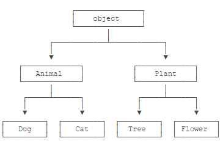

### 3、获取object信息

```python
#常用函数
type()                      #对象类型
isinstance(变量名，类名)      #判断class的类型
dir()                       #返回对象的所有属性和方法

#例子
class MyDog(object):
     def __len__(self):
        return 100
dog = MyDog()
len(dog)

class MyObject(object):
    def __init__(self):
         self.x = 9
     def power(self):
        return self.x * self.x

obj = MyObject()
#测试对象属性
hasattr(obj, 'x')    #有属性'x'吗？
obj.x
hasattr(obj, 'y')    #有属性'y'吗？
setattr(obj, 'y', 19)#设置一个属性'y'    
hasattr(obj, 'y')    #有属性'y'吗？    
getattr(obj, 'y')    #获取属性'y'    
obj.y                #获取属性'y'

```

### 4、__slots__

```python
##__slots__变量可以限制实例的属性
class Student(object):
    __slots__ = ('name', 'age') #用tuple定义允许绑定的属性名称
    
s = Student()      #创建新的实例
s.name = 'Michael' # 绑定属性'name'
s.age = 25         #绑定属性'age'
s.score = 99       #绑定属性'score'   会报错！！！

#slots定义的属性仅对当前类实例起作用，对继承的子类不起作用
class GraduateStudent(Student):
     pass

g = GraduateStudent()
g.score = 9999
```

### 5、@property装饰器

```python
#@property装饰器把一个方法变成属性调用
class Student(object):

    @property
    def score(self):
        return self._score

    @score.setter
    def score(self, value):
        if not isinstance(value, int):
            raise ValueError('score must be an integer!')
        if value < 0 or value > 100:
            raise ValueError('score must between 0 ~ 100!')
        self._score = value

s = Student()
s.score = 60 # 实际转化为s.set_score(60)
s.score        #实际转化为s.get_score()

s.score = 9999   #会报错

#定义只读属性
#只定义getter方法，不定义setter方法就是一个只读属性
class Student(object):

    @property
    def birth(self):
        return self._birth

    @birth.setter
    def birth(self, value):
        self._birth = value

    @property
    def age(self):
        return 2015 - self._birth   
#birth是可读写属性，而age是只读属性
```

### 6、多重继承

有四种动物：

- Dog - 狗狗；
- Bat - 蝙蝠；
- Parrot - 鹦鹉；
- Ostrich - 鸵鸟。

若按哺乳类和鸟类分：

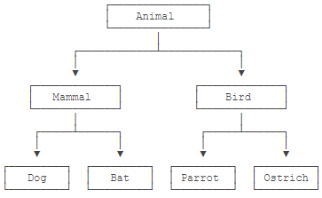

若按陆地动物和飞行动物来分：

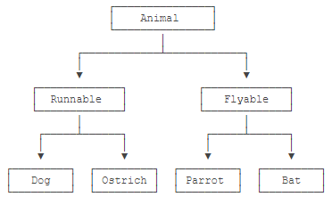

下面是将两种分类方式都包含的多重继承例子

```python
class Animal(object):
    pass

# 大类:
class Mammal(Animal):
    pass

class Bird(Animal):
    pass

# 各种动物:
class Dog(Mammal):
    pass

class Bat(Mammal):
    pass

class Parrot(Bird):
    pass

class Ostrich(Bird):
    pass

#给以上动物加两个分类
class Runnable(object):
    def run(self):
        print('Running...')

class Flyable(object):
    def fly(self):
        print('Flying...')

#多重继承
class Dog(Mammal, Runnable):
    pass

class Bat(Mammal, Flyable):
    pass
```

### 7、定制类

官方参考：https://docs.python.org/3/reference/datamodel.html#special-method-names

```python
#定制类的目的是为了简明扼要地看出实例内部的重要内容
#若不定制类
 class Student(object):
     def __init__(self, name):
         self.name = name
#此时用 print(Student('Michael'))输出的结果<__main__.Student object at 0x109afb190>不方便查看实例的信息

#加入定制
	def __str__(self):
         return 'Student object (name: %s)' % self.name
#print(Student('Michael'))输出结果变为Student object (name: Michael)


#若一个类要被用于for循环，必须使用__iter__(),该函数返回一个迭代对象
class Fib(object):
    def __init__(self):
        self.a, self.b = 0, 1 # 初始化两个计数器a，b

    def __iter__(self):
        return self # 实例本身就是迭代对象，故返回自己

    def __next__(self):
        self.a, self.b = self.b, self.a + self.b # 计算下一个值
        if self.a > 100000: # 退出循环的条件
            raise StopIteration()
        return self.a # 返回下一个值

for n in Fib():
     print(n)
        
#__getitem__()按下标取出元素
class Fib(object):
    def __getitem__(self, n):
        a, b = 1, 1
        for x in range(n):
            a, b = b, a + b
        return a
f = Fib()
f[0]
f[1]
f[2]
f[3]
f[10]
f[100]

#对实例作切片的方法
class Fib(object):
    def __getitem__(self, n):
        if isinstance(n, int): # n是索引
            a, b = 1, 1
            for x in range(n):
                a, b = b, a + b
            return a
        if isinstance(n, slice): # n是切片
            start = n.start
            stop = n.stop
            if start is None:
                start = 0
            a, b = 1, 1
            L = []
            for x in range(stop):
                if x >= start:
                    L.append(a)
                a, b = b, a + b
            return L
f = Fib()
f[0:5]
f[:10]

#对于类中没有的属性，运用__getattr__()动态返回一个值
#只有在没有找到属性的情况下，才调用__getattr__已有的属性
class Student(object):

    def __init__(self):
        self.name = 'Michael'

    def __getattr__(self, attr):
        if attr=='score':
            return 99

s = Student()
s.score  #会返回99

#返回函数
class Student(object):

    def __getattr__(self, attr):
        if attr=='age':
            return lambda: 25


```

### 8、枚举类

```python
#枚举是一种常见的数据标识或分类的工具
from enum import Enum

#创建一个Month的枚举类
Month = Enum('Month', ('Jan', 'Feb', 'Mar', 'Apr', 'May', 'Jun', 'Jul', 'Aug', 'Sep', 'Oct', 'Nov', 'Dec'))

#枚举所有成员
for name, member in Month.__members__.items():
    print(name, '=>', member, ',', member.value)
    
#派生出自定义类
from enum import Enum, unique
#@unique装饰器可以检查保证没有重复值
@unique
class Weekday(Enum):
    Sun = 0 # Sun的value被设定为0
    Mon = 1
    Tue = 2
    Wed = 3
    Thu = 4
    Fri = 5
    Sat = 6

#枚举类的用法
day1 = Weekday.Mon
print(day1)
print(Weekday.Tue)
print(Weekday['Tue'])
print(Weekday.Tue.value)
print(day1 == Weekday.Mon)
print(day1 == Weekday.Tue)
print(Weekday(1))
print(day1 == Weekday(1))
Weekday(7)
for name, member in Weekday.__members__.items():
     print(name, '=>', member)
```


## 三、Matplotlib绘图

官方参考：https://matplotlib.org/examples/index.html

### 1、绘图基础

```python
import matplotlib.pyplot as plt
#相关函数
figure() 主图
subplot() 副图

axex: 设置坐标轴边界和表面的颜色、坐标刻度值大小和网格的显示
figure: 控制dpi、边界颜色、图形大小、和子区( subplot)设置
font: 字体集（font family）、字体大小和样式设置
grid: 设置网格颜色和线性
legend: 设置图例和其中的文本的显示
line: 设置线条（颜色、线型、宽度等）和标记
patch: 是填充2D空间的图形对象，如多边形和圆。控制线宽、颜色和抗锯齿设置等。
savefig: 可以对保存的图形进行单独设置。例如，设置渲染的文件的背景为白色。
verbose: 设置matplotlib在执行期间信息输出，如silent、helpful、debug和debug-annoying。
xticks和yticks: 为x,y轴的主刻度和次刻度设置颜色、大小、方向，以及标签大小。

#linestyle() 线条风格
‘-‘							实线	
‘:’							虚线	 
‘–’							破折线		 
‘-.’						点划线    

#线条标记
‘o’                 圆圈  
‘.’                 点
‘D’                 菱形  
‘s’                 正方形
‘h’                 六边形1    
‘*’                 星号
‘H’                 六边形2    
‘d’                 小菱形
‘_’                 水平线 
‘v’                 一角朝下的三角形
‘8’                 八边形 
‘<’                 一角朝左的三角形
‘p’                 五边形 
‘>’                 一角朝右的三角形
‘,’                 像素  
‘^’                 一角朝上的三角形
‘+’                 加号  
‘\  ‘               竖线
‘None’,’’,’ ‘       无   
‘x’                 X

#颜色
b               蓝色  
g               绿色
r               红色  
y               黄色
c               青色
k               黑色   
m               洋红色 
w               白色

color = '#xxxx'或color = (x,x,x) #自定义颜色

在plot和subplot函数中可使用axisbg参数定义图片背景颜色
```

### 2、绘图设置实例

```python
import numpy as np
import pandas as pd
import matplotlib.pyplot as plt
from matplotlib.ticker import MultipleLocator

#使用numpy产生数据
x=np.arange(-5,5,0.1)
y=x*3

#创建窗口、子图
#方法1：先创建窗口，再创建子图。（一定绘制）
fig = plt.figure(num=1, figsize=(15, 8),dpi=80)     #开启一个窗口，同时设置大小，分辨率
ax1 = fig.add_subplot(2,1,1)  #通过fig添加子图，参数：行数，列数，第几个。
ax2 = fig.add_subplot(2,1,2)  #通过fig添加子图，参数：行数，列数，第几个。
print(fig,ax1,ax2)
#方法2：一次性创建窗口和多个子图。（空白不绘制）
fig,axarr = plt.subplots(4,1)  #开一个新窗口，并添加4个子图，返回子图数组
ax1 = axarr[0]    #通过子图数组获取一个子图
print(fig,ax1)
#方法3：一次性创建窗口和一个子图。（空白不绘制）
ax1 = plt.subplot(1,1,1,facecolor='white')      #开一个新窗口，创建1个子图。facecolor设置背景颜色
print(ax1)
#获取对窗口的引用，适用于上面三种方法
# fig = plt.gcf()   #获得当前figure
# fig=ax1.figure   #获得指定子图所属窗口

# fig.subplots_adjust(left=0)                         #设置窗口左内边距为0，即左边留白为0。

#设置子图的基本元素
ax1.set_title('python-drawing')            #设置图体，plt.title
ax1.set_xlabel('x-name')                    #设置x轴名称,plt.xlabel
ax1.set_ylabel('y-name')                    #设置y轴名称,plt.ylabel
plt.axis([-6,6,-10,10])                  #设置横纵坐标轴范围，这个在子图中被分解为下面两个函数
ax1.set_xlim(-5,5)                           #设置横轴范围，会覆盖上面的横坐标,plt.xlim
ax1.set_ylim(-10,10)                         #设置纵轴范围，会覆盖上面的纵坐标,plt.ylim

xmajorLocator = MultipleLocator(2)   #定义横向主刻度标签的刻度差为2的倍数。就是隔几个刻度才显示一个标签文本
ymajorLocator = MultipleLocator(3)   #定义纵向主刻度标签的刻度差为3的倍数。就是隔几个刻度才显示一个标签文本

ax1.xaxis.set_major_locator(xmajorLocator) #x轴 应用定义的横向主刻度格式。如果不应用将采用默认刻度格式
ax1.yaxis.set_major_locator(ymajorLocator) #y轴 应用定义的纵向主刻度格式。如果不应用将采用默认刻度格式

ax1.xaxis.grid(True, which='major')      #x坐标轴的网格使用定义的主刻度格式
ax1.yaxis.grid(True, which='major')      #x坐标轴的网格使用定义的主刻度格式

ax1.set_xticks([])     #去除坐标轴刻度
ax1.set_xticks((-5,-3,-1,1,3,5))  #设置坐标轴刻度
ax1.set_xticklabels(labels=['x1','x2','x3','x4','x5'],rotation=-30,fontsize='small')  #设置刻度的显示文本，rotation旋转角度，fontsize字体大小

plot1=ax1.plot(x,y,marker='o',color='g',label='legend1')   #点图：marker图标
plot2=ax1.plot(x,y,linestyle='--',alpha=0.5,color='r',label='legend2')   #线图：linestyle线性，alpha透明度，color颜色，label图例文本

ax1.legend(loc='upper left')            #显示图例,plt.legend()
ax1.text(2.8, 7, r'y=3*x')                #指定位置显示文字,plt.text()
ax1.annotate('important point', xy=(2, 6), xytext=(3, 1.5),  #添加标注，参数：注释文本、指向点、文字位置、箭头属性
            arrowprops=dict(facecolor='black', shrink=0.05),
            )
#显示网格。which参数的值为major(只绘制大刻度)、minor(只绘制小刻度)、both，默认值为major。axis为'x','y','both'
ax1.grid(b=True,which='major',axis='both',alpha= 0.5,color='skyblue',linestyle='--',linewidth=2)

axes1 = plt.axes([.2, .3, .1, .1], facecolor='y')       #在当前窗口添加一个子图，rect=[左, 下, 宽, 高]，是使用的绝对布局，不和以存在窗口挤占空间
axes1.plot(x,y)  #在子图上画图
plt.savefig('aa.jpg',dpi=400,bbox_inches='tight')   #savefig保存图片，dpi分辨率，bbox_inches子图周边白色空间的大小
plt.show()    #打开窗口，对于方法1创建在窗口一定绘制，对于方法2方法3创建的窗口，若坐标系全部空白，则不绘制
```

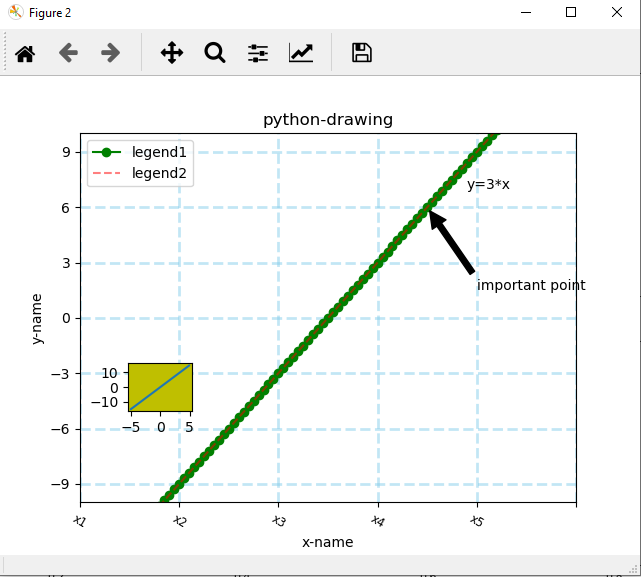


```python
#plot可设置参数
alpha                   浮点值
animated                [True / False]
antialiased or aa       [True / False]
clip_box                matplotlib.transform.Bbox 实例
clip_on                 [True / False]
clip_path               Path 实例， Transform，以及Patch实例
color or c              任何 matplotlib 颜色
contains                命中测试函数
dash_capstyle           ['butt' / 'round' / 'projecting']
dash_joinstyle          ['miter' / 'round' / 'bevel']
dashes                  以点为单位的连接/断开墨水序列
data                    (np.array xdata, np.array ydata)
figure                  matplotlib.figure.Figure 实例
label                   任何字符串
linestyle or ls         [ '-' / '--' / '-.' / ':' / 'steps' / ...]
linewidth or lw         以点为单位的浮点值
lod                     [True / False]
marker                  [ '+' / ',' / '.' / '1' / '2' / '3' / '4' ]
markeredgecolor or mec  任何 matplotlib 颜色
markeredgewidth or mew  以点为单位的浮点值
markerfacecolor or mfc  任何 matplotlib 颜色
markersize or ms        浮点值
markevery               [ None / 整数值 / (startind, stride) ]
picker                  用于交互式线条选择
pickradius              线条的拾取选择半径
solid_capstyle          ['butt' / 'round' / 'projecting']
solid_joinstyle         ['miter' / 'round' / 'bevel']
transform               matplotlib.transforms.Transform 实例
visible                 [True / False]
xdata                   np.array
ydata                   np.array
zorder                  任何数值
```

### 3、一窗口多图

```python
#一个窗口，多个图，多条数据
sub1=plt.subplot(211,facecolor=(0.1843,0.3098,0.3098))  #将窗口分成2行1列，在第1个作图，并设置背景色
sub2=plt.subplot(212)   #将窗口分成2行1列，在第2个作图
sub1.plot(x,y)          #绘制子图
sub2.plot(x,y)          #绘制子图

axes1 = plt.axes([.2, .3, .1, .1], facecolor='y')  #添加一个子坐标系，rect=[左, 下, 宽, 高]
plt.plot(x,y)           #绘制子坐标系，
axes2 = plt.axes([0.7, .2, .1, .1], facecolor='y')  #添加一个子坐标系，rect=[左, 下, 宽, 高]
plt.plot(x,y)
plt.show()
```

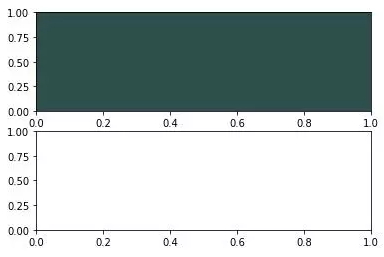

### 4、极坐标绘图

```python
fig = plt.figure(2)                                #新开一个窗口
ax1 = fig.add_subplot(1,2,1,polar=True)                  #启动一个极坐标子图
theta=np.arange(0,2*np.pi,0.02)              #角度数列值
ax1.plot(theta,2*np.ones_like(theta),lw=2)   #画图，参数：角度，半径，lw线宽
ax1.plot(theta,theta/6,linestyle='--',lw=2)           #画图，参数：角度，半径，linestyle样式，lw线宽

ax2 = fig.add_subplot(1,2,2,polar=True)                  #启动一个极坐标子图
ax2.plot(theta,np.cos(5*theta),linestyle='--',lw=2)
ax2.plot(theta,2*np.cos(4*theta),lw=2)

ax2.set_rgrids(np.arange(0.2,2,0.2),angle=45)   #距离网格轴，轴线刻度和显示位置
ax2.set_thetagrids([0,45,90])                   #角度网格轴，范围0-360度

plt.show()
```

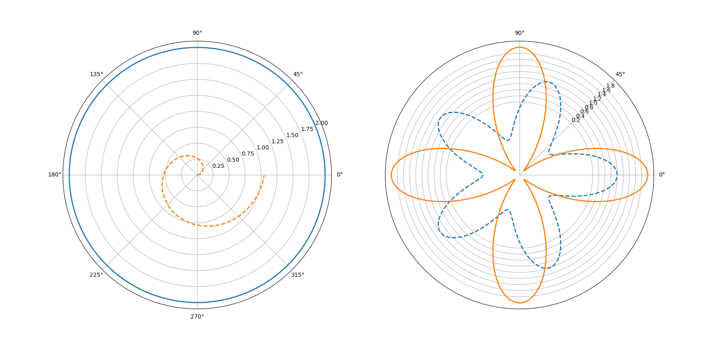

### 5、柱形图

```python
plt.figure(3)
x_index = np.arange(5)   #柱的索引
x_data = ('A', 'B', 'C', 'D', 'E')
y1_data = (20, 35, 30, 35, 27)
y2_data = (25, 32, 34, 20, 25)
bar_width = 0.35   #定义一个数字代表每个独立柱的宽度

rects1 = plt.bar(x_index, y1_data, width=bar_width,alpha=0.4, color='b',label='legend1')            #参数：左偏移、高度、柱宽、透明度、颜色、图例
rects2 = plt.bar(x_index + bar_width, y2_data, width=bar_width,alpha=0.5,color='r',label='legend2') #参数：左偏移、高度、柱宽、透明度、颜色、图例
#关于左偏移，不用关心每根柱的中心不中心，因为只要把刻度线设置在柱的中间就可以了
plt.xticks(x_index + bar_width/2, x_data)   #x轴刻度线
plt.legend()    #显示图例
plt.tight_layout()  #自动控制图像外部边缘，此方法不能够很好的控制图像间的间隔
plt.show()
```

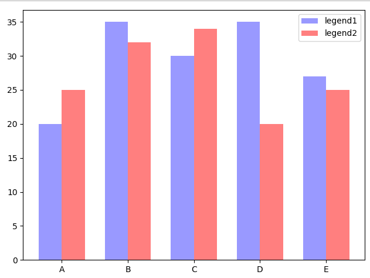

### 6、直方图

```python
fig,(ax0,ax1) = plt.subplots(nrows=2,figsize=(9,6))     #在窗口上添加2个子图
sigma = 1   #标准差
mean = 0    #均值
x=mean+sigma*np.random.randn(10000)   #正态分布随机数
ax0.hist(x,bins=40,normed=False,histtype='bar',facecolor='yellowgreen',alpha=0.75)   #normed是否归一化，histtype直方图类型，facecolor颜色，alpha透明度
ax1.hist(x,bins=20,normed=1,histtype='bar',facecolor='pink',alpha=0.75,cumulative=True,rwidth=0.8) #bins柱子的个数,cumulative是否计算累加分布，rwidth柱子宽度
plt.show()  #所有窗口运行
```

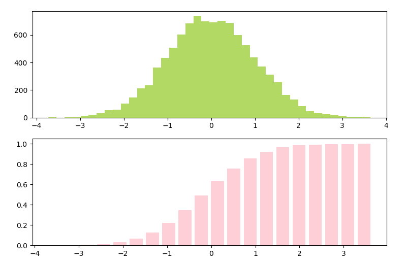

### 7、散点图

```python
fig = plt.figure(4)          #添加一个窗口
ax =fig.add_subplot(1,1,1)   #在窗口上添加一个子图
x=np.random.random(100)      #产生随机数组
y=np.random.random(100)      #产生随机数组
ax.scatter(x,y,s=x*1000,c='y',marker=(5,1),alpha=0.5,lw=2,facecolors='none')  #x横坐标，y纵坐标，s图像大小，c颜色，marker图片，lw图像边框宽度
plt.show()  #所有窗口运行
```

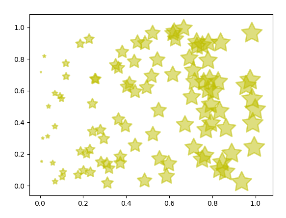

### 8、三维图

```python
from matplotlib import pyplot as plt
import numpy as np
from mpl_toolkits.mplot3d import Axes3D

fig = plt.figure()
ax = Axes3D(fig)
X = np.arange(-4, 4, 0.25)
Y = np.arange(-4, 4, 0.25)
X, Y = np.meshgrid(X, Y)
R = np.sqrt(X**2 + Y**2)
Z = np.sin(R)

# 具体函数方法可用 help(function) 查看，如：help(ax.plot_surface)
ax.plot_surface(X, Y, Z, rstride=1, cstride=1, cmap='rainbow')

plt.show()
```

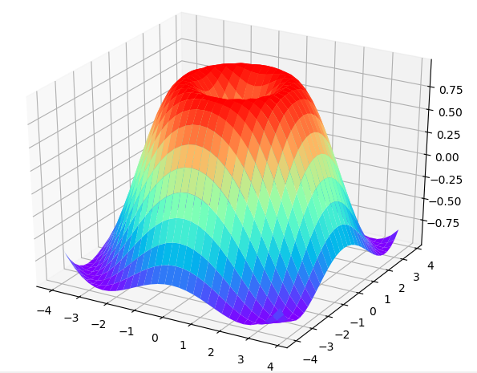

```python
#3D散点图
data = np.random.randint(0, 255, size=[40, 40, 40])

x, y, z = data[0], data[1], data[2]
ax = plt.subplot(111, projection='3d')  # 创建一个三维的绘图工程
#  将数据点分成三部分画，在颜色上有区分度
ax.scatter(x[:10], y[:10], z[:10], c='y')  # 绘制数据点
ax.scatter(x[10:20], y[10:20], z[10:20], c='r')
ax.scatter(x[30:40], y[30:40], z[30:40], c='g')

ax.set_zlabel('Z')  # 坐标轴
ax.set_ylabel('Y')
ax.set_xlabel('X')
plt.show()
```

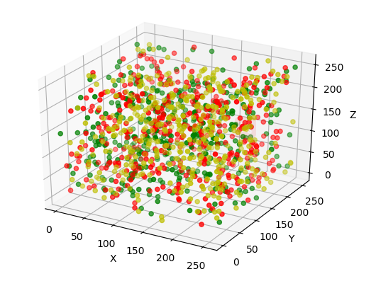

## 四、Numpy

官方参考：https://numpy.org/doc/stable/reference/index.html

NumPy是Python数值计算最重要的基础包，支持高级大量的维度数组与矩阵运算，大多数提供科学计算的包都是使用Numpy的数组作为构建基础。Numpy内部解除了Python的PIL(全局解释器锁),运算效率极好,是大量机器学习框架的基础。大二时也自学过一些机器学习相关的知识，那时候就非常不理解numpy使用，但也没有太在意，觉得numpy就是类似MATLAB中的矩阵，把事情想得太简单了，导致自学效果极差。

### 1、ndarray

NumPy最重要的一个特点就是其N维数组对象（即ndarray），该对象是一个快速而灵活的大数据集容器。你可以利用这种数组对整块数据执行一些数学运算，其语法跟标量元素之间的运算一样。

```python
import numpy as np
#生成一个2列3行的二维数组
data = np.random.rand(2,3)
data

#数学运算
data*10 #每个元素都乘10
data + data #对应元素相加

# ndarray是一个通用的同构数据多维容器，也就是说，其中的所有元素必须是相同类型的。每个数组都有一个shape（一个表示各维度大小的元组）和一个dtype（一个用于说明数组数据类型的对象）：
data.shape
data.type

#创建ndarray
data1 = [x,x,x,x,x,x] 
arr1 = np.array(data1)

#嵌套
data2 = [[x,x,x],[x,x,x]]
arr2 = np.array(data2)

#验证属性的三个函数
arr2.ndim
arr2.shape
arr2.dtype

#全0、1数组或全空数组
np.zeros(10)
np.zeros((3,6))
np.empty((2,3,2)) #返回的是未初始化的垃圾值
np.ones((3,6))
```


**ndarray的数据类型**：

dtype（数据类型）是一个特殊的对象，它含有ndarray将一块内存解释为特定数据类型所需的信息。是NumPy灵活交互其它系统的源泉之一。多数情况下，它们直接映射到相应的机器表示，这使得“读写磁盘上的二进制数据流”以及“集成低级语言代码（如C、Fortran）”等工作变得更加简单。数值型dtype的命名方式相同：一个类型名（如float或int），后面跟一个用于表示各元素位长的数字。标准的双精度浮点值（即Python中的float对象）需要占用8字节（即64位）。因此，该类型在NumPy中就记作float64。

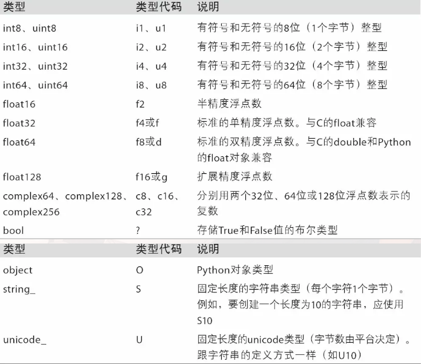

改变数据类型课使用`float_arr = arr.astype(np.float64)`

### 2、基本运算

```python
#条件判断
score = np.array([[80,90],[79,81],[80,75],[88,83],[75,81]])
score > 80

#三目运算
np.where(score < 80, 0, 90)

#统计
np.amax(score,axis = 0)#每列最大值
np.amax(score,axis = 1)#每行最大值

np.amin(score,axis = 0)#每列最小值
np.amin(score,axis = 1)#每行最小值

np.mean(score,axis = 0)#每列平均值
np.mean(score,axis = 1)#每行平均值

np.std(score,axis = 0)#每列方差
np.std(score,axis = 1)#每行方差

#线性代数
#矩阵转置
arr.T

#内积
np.dot(arr.T, arr)

#高维数组转置
#在这里，如果我们使用arr.shape()，则会返回（2，2，4），第一个2表示两组，第二个则表示每组都有两行，4则表示4列。而这三个数字由一个元组(0,1,2)进行索引，所以使用arr.transpose((1, 0, 2))时，则表示将第一位数与第二位数交换位置
arr = np.arange(16).reshape((2,2,4))
arr.transpose((1,0,2))
#也可以使用.T进行操作，不过.T进行的只是轴对换而已
arr.T
# ndarray还有一个swapaxes方法，它需要接受一对轴编号
arr.swapaxes()


#矩阵拼接
#水平拼接
v1 = np.arrange(12).reshape(2,6)
v1
v2 = np.linspace(12,24,12).reshape(2,6)
v2
np.hstack((v1,v2))

#垂直拼接
np.vstack((v1,v2))

#数组删除
np.delete(arr, obj, axis=None)
# 删除多列,会把没有被选中的其他值也删掉,有损失
b3 = np.delete(a, [1,2], axis=1)
```

其他函数：

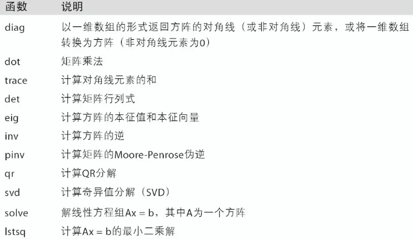

### 3、索引和切片

```python
#沿着第0轴（即第一个轴）切片的,切片是沿着一个轴向选取元素的,表达式arr2d[:2]可以被认为是“选取arr2d的前两行”。
arr2d
arr2d[:2]

#一次传入多个切片
arr2d[:2,1:]
```

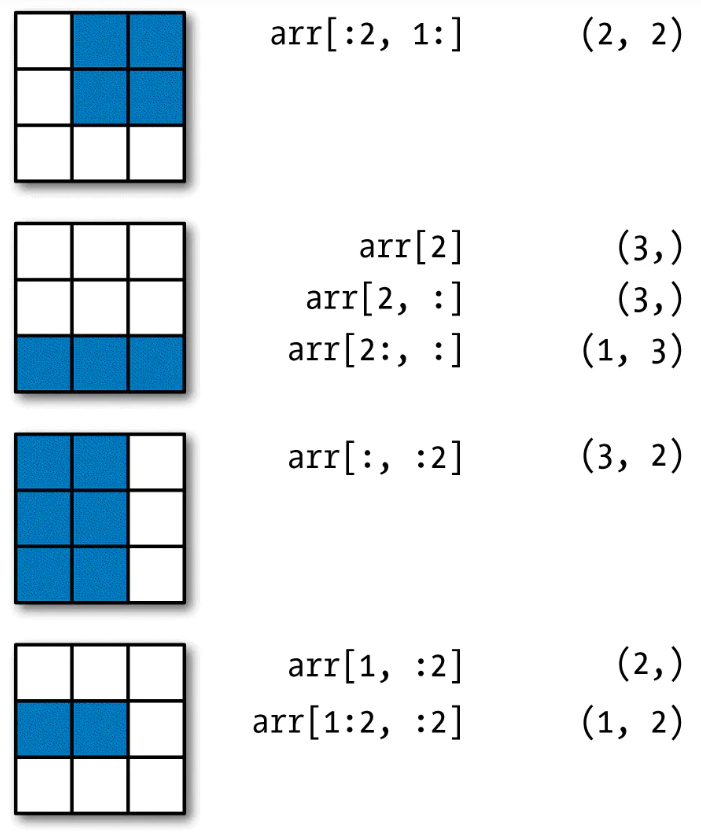

### 4、索引

```python
##假设我们有一个用于存储数据的数组以及一个存储姓名的数组（含有重复项），在这里使用numpy.random中的randn函数（上面表格中漏了这个）生成一些正态分布的随机数据
names = np.array(['Bob','Joe','Will','Bob','Joe','Joe'])
data = np.random.randn(7,4)
names
data

#假设每个名字都对应data数组中的一行，而我们想要选出对应于名字"Bob"的所有行。跟算术运算一样，数组的比较运算（如==）也是矢量化的。因此，对names和字符串"Bob"的比较运算将会产生一个布尔型数组，这个布尔型数组课用于数组索引
data[names =='Bob']
#布尔型数组的长度必须跟被索引的轴长度一致，如果布尔型数组的长度不对，布尔型选择就会出错

#与切片结合使用
data[names =='Bob',2:]
data[names == 'Bob',3]
data[(names == 'Bob') | (names == 'Will')]

#Fancy indexing
array([[ 0.,  0.,  0.,  0.],
       [ 1.,  1.,  1.,  1.],
       [ 2.,  2.,  2.,  2.],
       [ 3.,  3.,  3.,  3.],
       [ 4.,  4.,  4.,  4.],
       [ 5.,  5.,  5.,  5.],
       [ 6.,  6.,  6.,  6.],
       [ 7.,  7.,  7.,  7.]])

#为了以特定顺序选取行子集，只需传入一个用于指定顺序的整数列表或ndarray即可
arr[[4,3,0,6]]

#使用负数索引将会从末尾开始选取行
arr[[-3.,-5,-7]]

#一次传入多个索引数组会返回一个一维数组，其中的元素对应各个索引元组
arr = np.arange(32).reshape((8,4))
arr = [[1,5,7,2],[0,3,1,2]]
```

### 5、随机数

```python
#numpy中的随机数生成要比python内置的random快非常多
from random import normalvariate
N = 1000000
#Python内置random
%timeit samples = [normalvariate(0,1) for _ in range(N)]

#numpy的random
%timeit np.random.normal(size = N)

#更改随机数种子
np.random.seed(1234)

#numpy.random的数据生成函数使用了全局的随机种子。要避免全局状态，我们可以使用numpy.random.RandomState，创建一个与其它隔离的随机数生成器
rng = np.random.RandomState(1234)
rng.randn(10)

#random中其他函数
seed       #随机数生成器的种子
permutation #返回一个序列的随机排列或返回一个随机排列的范围
shuffle    #对一个序列就地随机排列
rand    #产生均匀分布的样本值
randint    #从给定的上下限范围内随机选取整数
randn      #产生正态分布
binomial   #产生二项分布的样本值
normal      #产生高斯分布的样本值
beta        #产生beta分布的样本值
chisquare   #产生卡方分布样本值
gamma       #产生gamma分布样本值
uniform      #产生0~1中均匀分布的样本值
```

### 6、数据存取

```python
a = np.array([['张三','李四','王五','赵六'],['11','12','13','14','15']])
b = np.arange(24).reshape((2,3,4))

np.save('a.npy',a)                      # 存为.npy文件
np.savez("a.npz", ar0 = a, ar1 = b)     # 多个数组存入一个.npz压缩包

c = np.load('x.npy')                    # .npy文件读入数组

d = np.load("y.npz")                    # .npz压缩包读入
["ar0"]                               # 单独输出数组

# 存储csv文件,本身是ASCII字符，不能存储非ASCII字符串,csv文件只能存储一维、二维数据，不能存储多维数据
np.savetxt(frame,array,fmt='%.18e',delimiter=None)
#存储参数
#frame：储存文件、字符串或生成器的名字，可以是.gz或.bz2的压缩文件，对大型数据有用，压缩后存储或读取，节省内存资源
#array:存入文件的数组
#delimiter：分隔字符串，默认是空格
#fmt：写入文件中每个元素的字符串格式，例如：%d整数，%.2f两位浮点数、%s ASCII字符 %.18e 科学计数法

#读取csv
# 读取csv文件
np.loadtxt(frame,dtype=np.float,delimiter=None,skiprows=0,usecols=None,unpack=False)
# 去掉b'0.00'中的b
np.loadtxt('a.csv', dtype=bytes, delimiter=',').astype(str)
#读取参数
#frame、dtype、delimiter同上，skiprows 跳过千x行，一般跳过第一行表头
#usecols 读取指定的列、索引、元组类型
#unpack 如果True，读入属性将分别写入不同数组变量，False读入数据只写入一个数组变量，默认False

```


### 7、numpy常用函数表

```python
np.dtype	      #指定当前numpy对象的整体数据
np.itemsize	      #对象中每个元素的大小, 单位字节
np.size	          #对象元素的个数, 相当于np.shape中的n*m值
np.shape	      #查看数组形状, 对于矩阵, n行m列
np.ndim	          #秩
np.isnan(list)	  #筛选出nan值
np.iscomplex(list)#筛选出非复数
~	              #取补运算符
np.array(数组, dtype=np.bool)	 #自定义数组类型
np.astype(np.bool)	          #转换数组类型
np.mat()	      #将python 列表转化成矩阵
np.mat().getA()	  #将matrix对象转成ndarray对象
np.matrix()	      #同上
np.asmatrix()	  #将ndarray对象转成matrix对象
np.tile()	      #重复某个数组。比如tile(A,n)，功能是将数组A重复n次，构成一个新的数组传送门
np.I	          #矩阵求逆
np.T	          #矩阵转置, 行变列, 列变行, 对角线翻转矩阵
np.tolist()	      #转换成python列表, 用于和python原生结合写程序
np.multiply(x, y) #矩阵x 矩阵y相乘
np.unique()	      #数组驱虫, 并且从小到大生成一个新的数组
np.arange	      #同python range()
np.arange(24).reshape((2, 3, 4) #创建一个2维3行4列的数组, 必须能被给定的长度除开, 可以索引和切片
np.arange(24).resize((2, 3, 4))	#同上, 会修改原值
np.linspace(x, y, z)	        #等间距生成, x起始, y截止, z步长
np.ones(x)	      #生成都是x的数组, 可传递三维数组, 几行几列, 具体的个数
np.zeros(x)	      #生成都是0的数组
np.full([x, y], z)#自定义模板数组, 生成x行y列都是z的数组
np.eye(x)	      #创建一个正方的x*x单位的矩阵, 对角线为1, 其余为0
np.flatten()	  #数组降维, 不改变 原值
np.random.rand(x, y, z)	#生成一个一维x随机数或生成x*y的随机数组
np.random.randn(x, y)	#正态分布随机数
np.random.randint(low, high, (shape))	#整数随机数
np.random.normal(loc, scale, (size))	#从指定正态分布中抽取样本, loc为概率分布的均匀值, 标准差scale
np.random.seed(s)  #给一个随机数字固定
np.randomunifrom(low, high, (size))	#均匀分布的数组, 有小数
np.random.shuffle(a) #将数组a的第0轴(最外维度)进行随机排列(洗牌), 改变数组a, 行边列不变
np.random.permutation(a)	#同上, 不改变数组a
np.random.choice(a, size=None, replace=False, p=数组a/np.sum(b)) #从一维数组a中以概率p抽取元素，形成size形状新数组，replace表示是否可以重用元素，默认为False，p为抽取概率,本位置越高,抽取概率越高
np.sum(axis=None)	#求和, axis=0为列, 1为行
np.argsort()	    #矩阵每个元素坐标排序
np.sort(axix=None)	#从小打大排序
-np.sort(axis=None)	#从大到小排序
np.sort_values(‘字段’, ascending=False)	#排序,升序排列
np.mean(axis=None)	#平均数
np.average(axis=None,weights=None)	#加权平均，weights加权值，不设为等权重,例子[10, 5, 1],每列分别X10,X5,X1在/(10+5+1)
np.var(axis=None)	#方差：各数与平均数之差的平方的平均数
np.std(axis=None)	#标准差:方差平方根
np.min(axis=None)	#最小值
np.argmin(axis=None)#求数组中最小值的坐标
np.median(axis=None)#中位数
np.ptp(axis=None)	#元素最大值与最小值的差
np.cumsum()	        #累加,cumsum和cumprod之类的方法不聚合，产生一个中间结果组成的数组,默认一维数组,1为按原样
np.cumprod()	    #累乘
np.count_nonzero(arr > 0)	#计数非0值个数,布尔值会被强制转换为1和0，可以使用sum()对布尔型数组中的True值计数
np.bools.any()	    #测试数组中是否存在一个或多个True
np.bools.all()	    #数组中所有值是否都是True, 测试有没有空值
np.bools.all()	    #数组中所有值是否都是True, 测试有没有空值
np.bools.all()	    #数组中所有值是否都是True, 测试有没有空值
```


